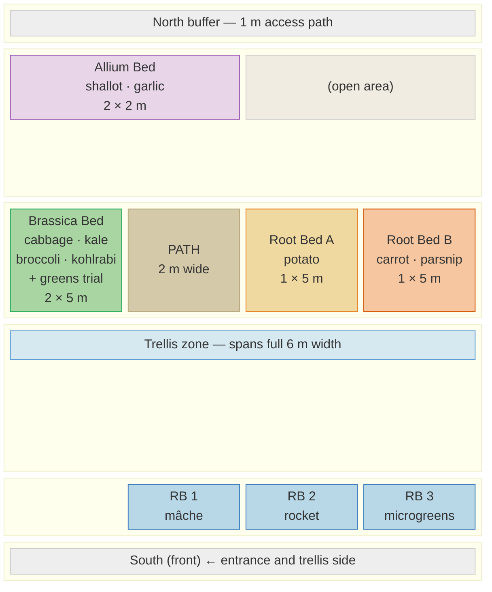

# Garden Layout — Mermaid Diagram

Rendered version of the garden plan. View in any Markdown editor with Mermaid support (VS Code, GitHub, etc.).

---

## Top-Down Layout

---

## Orientation Key

| Direction | Feature |
|---|---|
| **North** (top) | Rear of garden — buffer path |
| **South** (bottom) | Front — trellis and raised beds |
| **West** (left) | Fence line — Brassica Bed + Allium Bed |
| **East** (right) | Entrance — Root Beds A + B |

---

## Bed Areas

| Bed | Dimensions | Area |
|---|---|---|
| Brassica Bed | 2 × 5 m | 10 m² |
| Allium Bed | 2 × 2 m | 4 m² |
| Root Bed A | 1 × 5 m | 5 m² |
| Root Bed B | 1 × 5 m | 5 m² |
| Trellis RB 1–3 | 0.9 × 1.2 m × 3 | 3.24 m² |
| **Total growing area** | | **~27 m²** |
